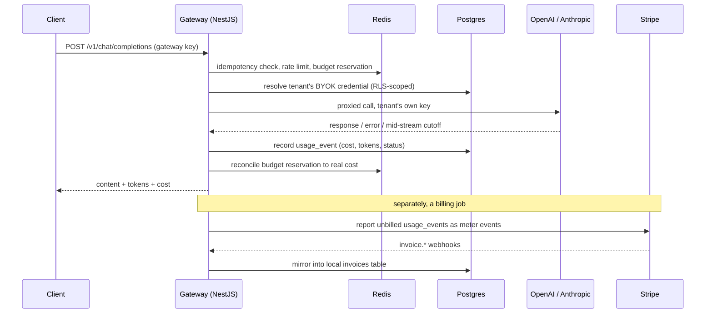

# Metergate

An AI usage metering & billing gateway — a proxy that sits in front of LLM
provider APIs (OpenAI, Anthropic), meters every call, and turns that usage
into real, Stripe-backed billing.

## The problem

Once an AI feature ships, the questions that actually matter are operational
ones: how much did this cost, who used it, is any tenant about to blow
through their budget, and how do you bill for consumption that varies call
to call? Most AI demo projects skip straight past this. Metergate is built
around it.

## What it does

- **Proxies calls to OpenAI/Anthropic** on behalf of a tenant, using the
  tenant's own API key (BYOK) — the gateway never holds provider credit.
- **Meters every call**: input/output tokens, latency, and a cost figure
  resolved against a versioned pricing table (so a price update never
  rewrites historical billing).
- **Attributes cost** by tenant, project, and an arbitrary `feature` tag the
  caller passes in — the same idea as Stripe's `metadata`, applied to LLM
  spend instead of payments.
- **Enforces budgets and rate limits in real time** via Redis, using the
  same reserve-then-reconcile pattern a payment authorization hold uses:
  optimistically reserve the estimated cost before the call, true it up
  against the real cost after.
- **Fails fast on a broken provider**: a circuit breaker per
  (provider, model) opens after repeated failures and rejects new calls for
  a cooldown window instead of piling up timeouts.
- **Never double-counts.** A repeated `Idempotency-Key` replays the cached
  response instead of calling the provider again; a call cut off mid-stream
  is billed for exactly what was delivered, not what was requested, and
  never recorded as a plain failure.
- **Bills through Stripe** (test mode) using the modern Meters API —
  unbilled usage gets reported as real meter events, and invoice webhooks
  mirror into a local `invoices` table.
- **Exposes Prometheus metrics** (`/metrics`): request counts by outcome,
  a latency histogram, and circuit breaker state — the same signals a real
  on-call engineer would check.

## Why BYOK

The gateway emits its own API keys to tenants (`sk-mg-...`), but tenants
supply their own OpenAI/Anthropic credentials, encrypted at rest
(AES-256-GCM). This removes the financial risk of fronting provider credit
while keeping every interesting engineering problem — metering,
attribution, limits, billing — fully intact. The "platform holds the
credit" model is deliberately scoped out; see `CLAUDE.md` for the full list
of what's out of scope and why.

## Try it

```bash
curl -X POST http://localhost:3000/v1/chat/completions \
  -H "Authorization: Bearer sk-mg-live-..." \
  -H "Content-Type: application/json" \
  -H "Idempotency-Key: <any-unique-string>" \
  -d '{
    "provider": "openai",
    "model": "gpt-4o-mini",
    "messages": [{ "role": "user", "content": "hello gateway" }],
    "feature": "demo"
  }'
```

returns:

```json
{
  "content": "...",
  "inputTokens": 3,
  "outputTokens": 12,
  "costUsdMicros": 7650,
  "latencyMs": 812
}
```

Tenants manage their own keys through `/api-keys` (create, list, revoke,
rotate — see `apps/api/src/api-keys`). A rotated key keeps working for a
configurable grace period instead of being cut off instantly.

## Architecture

```
apps/api/     NestJS — gateway proxy, metering, budgets, Stripe billing
apps/web/     Next.js — usage & billing dashboard
packages/shared/  zod schemas shared between api and web
```



Postgres enforces tenant isolation with row-level security; the app
connects as an unprivileged role (`metergate_app`) that cannot bypass it,
even as the table owner. Two identity-resolution problems — authenticating
a gateway key, and mapping a Stripe webhook back to a tenant — happen
*before* any tenant context exists, so both go through narrowly-scoped
`SECURITY DEFINER` Postgres functions rather than the normal RLS-scoped
query path. Redis holds real-time rate-limit and budget counters, with
Postgres (`usage_events`) as the durable source of truth.

## Running locally

Requires Docker. Nothing runs on the host directly.

```bash
cp .env.example .env
docker compose up
```

- API: http://localhost:3000
- Dashboard: http://localhost:3001

Run migrations, seed a demo tenant, and run tests inside the containers:

```bash
docker compose exec api npm run migrate:up
docker compose exec api npm run seed        # prints a demo API key
docker compose exec api npm test            # unit tests
docker compose exec api npm run test:integration  # Postgres + Redis backed
```

## Testing philosophy

Nothing here calls a real LLM provider or a real Stripe account. Provider
adapters and the Stripe client are tested against mocked `fetch`, matching
their documented request/response shapes; the mock provider adapter
deterministically simulates five real-world incidents (success, timeout,
rate limit, mid-stream cutoff, malformed response) so the gateway's error
handling is exercised without flakiness or cost. Everything that touches
Postgres or Redis runs as a real integration test against the actual
services via `docker-compose`, not a mocked database client.

## Status

Phases 1 through 6 of the build plan are complete: foundation, the central
metering path (auth, BYOK, pricing, the proxy itself), reliability
(idempotent replay, circuit breaker), rate limiting and budget reservation,
Stripe billing (client, webhooks, invoice mirror, usage reporting), and
observability (Prometheus metrics, API key rotation).

**Explicitly not built, on purpose:**

- **Streaming responses** (SSE passthrough to the client) — the proxy is
  non-streaming for now; the reliability work for partial delivery
  (mid-stream cutoff billing) is already in place ahead of it.
- **A live Stripe account** — Colombia isn't a supported Stripe account
  country, so the billing integration is built and tested against Stripe's
  documented API contracts rather than a live sandbox. Swapping in real
  test-mode credentials requires no code changes.
- **A scheduled trigger** for the usage-billing job and budget/circuit
  breaker state being distributed across multiple instances — both are
  documented as platform-level or multi-instance concerns, not silently
  assumed away.
- **Public deployment** — deliberately last, once the code is done.

See `CLAUDE.md` for the full architecture, every scope decision and why,
and known gotchas.
